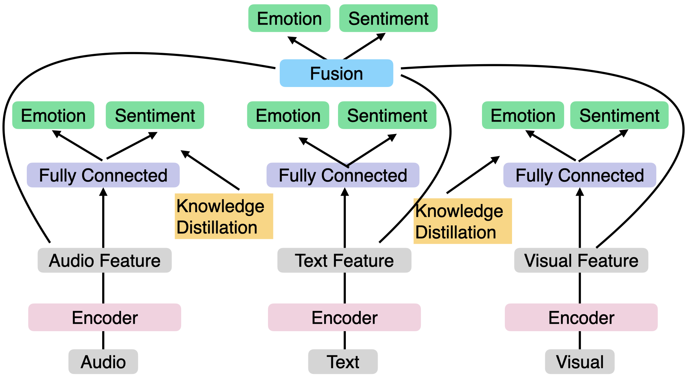

# センチメント情報と深層距離学習を考慮した会話におけるマルチモーダル感情認識モデル

モデルの全体構造

以下の操作を、順番に行ってください。
## リポジトリのクローン
```bash
git clone https://github.com/midoor801/SCL.git
```
## 実験環境
Ubuntu環境で、NVIDIA Driverおよびanacondaのインストールが行われていることを想定します。以下のコマンドを実行してください。
1. python 3.9
```
conda create -n SCL python=3.9
source activate SCL
```
2. requirements.txt
```
pip install -r requirements.txt
```
3. ffmpegのインストール

ffmpegがインストールされているか確認してください。
```
ffmpeg -version
```
インストールされていない場合は、以下のコマンドを実行してください。
```
sudo apt update
sudo apt install ffmpeg
```
## データセット
各データセットを[datasetディレクトリ](./dataset)に配置してください。
1. [MELD](https://affective-meld.github.io)

下記のコマンドを実行してください。
```
wget http://web.eecs.umich.edu/~mihalcea/downloads/MELD.Raw.tar.gz
```
インストールできない場合は、以下のコマンドを実行してください
```
wget --no-check-certificate 
https://web.eecs.umich.edu/~mihalcea/downloads/MELD.Raw.tar.gz
```
解凍して得られたデータを[MELD.Rawディレクトリ](./dataset/MELD.Raw)に配置してください。また、アノテーションファイルであるcsvファイル3種類は、MELDのtarファイルに格納されているものではなく、このリポジトリのものを使用してください。このうち、[訓練データ](./dataset/MELD.Raw/train_splits)にあるdia125_utt3.mp4は[このリンク](https://github.com/declare-lab/MELD/issues/39#issuecomment-1113166077)のデータと置き換えてください。

その後、以下のコマンドを実行して、MELDの動画データから音声データへの変換を行ってください。
```
python to_wav.py
```
2. [IEMOCAP](https://sail.usc.edu/iemocap/)

上記のリンクのreleaseページに従い、データのリクエストを行ってください。入力したメールアドレスに返信が来るので、データを取得してください。ここでは、データのうち、IEMOCAP_full_release.tarファイルを使用します。解凍して得られたデータを[IEMOCAP_full_releaseディレクトリ](./dataset/IEMOCAP_full_release)に配置してください。

最終的に、[datasetディレクトリ](./dataset)の構造が以下のようになるように配置してください。
```
.
├── IEMOCAP_full_release
│   ├── Session1
│   │   ├── dialog
│   │   │   └── avi
│   │   │       └── DivX
│   │   │           ├── ._Ses01F_impro01.avi
│   │   │           ├── ...
│   │   └── sentences
│   │       └── wav
│   │           ├── Ses01F_impro01
│   │           ├── ...
│   ├── Session2
│   │   ├── dialog
│   │   │   └── avi
│   │   │       └── DivX
│   │   └── sentences
│   │       └── wav
│   ├── Session3
│   │   ├── dialog
│   │   │   └── avi
│   │   │       └── DivX
│   │   └── sentences
│   │       └── wav
│   ├── Session4
│   │   ├── dialog
│   │   │   └── avi
│   │   │       └── DivX
│   │   └── sentences
│   │       └── wav
│   └── Session5
│       ├── dialog
│       │   └── avi
│       │       └── DivX
│       └── sentences
│           └── wav
├── MELD.Raw
│   ├── dev_splits_complete
│   │   ├── dia0_utt0.mp4
│   │   ├── ...
│   ├── output_repeated_splits_test
│   └── train_splits
└── MELD.Wav
    ├── dev_splits_complete
    │   ├── dia0_utt0.wav
    │   ├── ...
    ├── output_repeated_splits_test
    └── train_splits
```
## 訓練
このモデルは、GPUのVRAMが24GB以上あることを想定しています。
1. MELD

8GB以上24GB未満のVRAM環境で実行する場合は、[teacher.py](./MELD/teacher.py)および[student.py](./MELD/student.py)のbatch_sizeを1に設定し、[fusion.py](./MELD/fusion.py)のbatch_sizeを4に設定してください。
```
python MELD/teacher.py
python MELD/student.py
python MELD/fusion.py
```
学習ログをファイルに出力する場合は、コマンドの末尾に| tee -a log/MELD_log.txtをつけてください。

2. IEMOCAP

8GB以上24GB未満のVRAM環境で実行する場合は、[teacher.py](./IEMOCAP/teacher.py)および[student.py](./IEMOCAP/student.py)のbatch_sizeを1に設定してください。
```
python IEMOCAP/teacher.py
python IEMOCAP/student.py
python IEMOCAP/fusion.py
```
学習ログをファイルに出力する場合は、コマンドの末尾に| tee -a log/IEMOCAP_log.txtをつけてください。
## 推論
```
python MELD/inference.py
python IEMOCAP/inference.py
```
## t-SNEによる特徴空間の可視化
```
python MELD/tsne.py
python IEMOCAP/tsne.py
```
## MELDに対する感情別のワードクラウド
```
python MELD/wc.py
```

なお、訓練や推論、その後の処理を連続して行う際には、以下のコマンドを使用することもできます。
```
bash MELD.sh
bash IEMOCAP.sh
```
